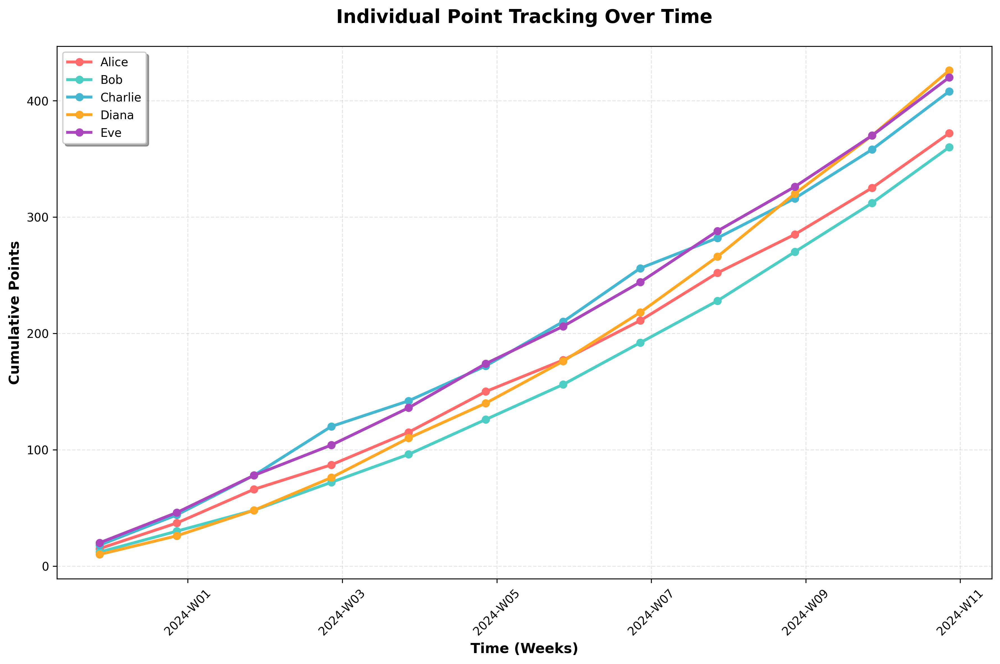

# Spring PetClinic Sample Application

A Spring Boot application for managing pet clinic operations, including pet adoption and test tracking capabilities.

## Features

### 🏠 Home Page
Welcome page providing an overview of the application and its features.

### ❤️ Pet Adoption Tab
View and manage pets available for adoption with detailed information:
- Pet Name
- Species (Dog, Cat, etc.)
- Breed
- Age
- Adoption Status (Available, Pending, Adopted)
- Intake Date
- Notes

### 🧪 Pet Test Tab
Track pet tests and examinations with comprehensive records:
- Pet Name
- Test Type (Blood Test, Vaccination, Physical Examination, etc.)
- Date Administered
- Result
- Veterinarian
- Follow-up Needed (Yes/No)

## Technology Stack

- **Backend**: Spring Boot 3.4.2
- **Frontend**: Thymeleaf templates with Bootstrap 5
- **Database**: H2 (in-memory)
- **Build Tool**: Maven
- **Java Version**: 17+

## Individual Point Tracking

This application includes a point tracking system that monitors individual performance over time. Below is a line chart showing the cumulative point totals for each individual per week, with each person represented by a unique color.



The chart displays:
- **X-axis**: Time segmented by week (2024-W00 to 2024-W11)
- **Y-axis**: Cumulative point total for each individual
- **Lines**: Each individual is represented by a unique color:
  - Alice (Red): #FF6B6B
  - Bob (Teal): #4ECDC4
  - Charlie (Blue): #45B7D1
  - Diana (Orange): #FFA726
  - Eve (Purple): #AB47BC

### Chart Generation

To regenerate the chart with updated data:

```bash
cd petclinic_new
python3 scripts/generate_chart.py
```

This will create:
- `charts/individual_points_line_chart.png` - The line chart visualization
- `charts/point_tracking_data.json` - Raw data used for chart generation

## Getting Started

### Prerequisites

- Java 17 or newer
- Maven 3.6+

## Run Petclinic locally

Spring Petclinic is a [Spring Boot](https://spring.io/guides/gs/spring-boot) application built using [Maven](https://spring.io/guides/gs/maven/) or [Gradle](https://spring.io/guides/gs/gradle/). You can build a jar file and run it from the command line (it should work just as well with Java 17 or newer):

```bash
git clone https://github.com/hangwan97/petclinic_new.git
cd petclinic_new
mvn spring-boot:run
```

You can then access the Petclinic at <http://localhost:8080/>.

### Application Pages

Once the application is running, you can navigate to:

- **Home**: http://localhost:8080/ - Welcome page with application overview
- **Adoption**: http://localhost:8080/adoption - Pet adoption management
- **Test**: http://localhost:8080/test - Pet test and examination records

## Building the Application

To build the application without running it:

```bash
mvn clean compile
```

To package the application as a JAR:

```bash
mvn clean package
java -jar target/spring-petclinic-3.4.0-SNAPSHOT.jar
```

## Project Structure

```
src/
├── main/
│   ├── java/
│   │   └── org/springframework/samples/petclinic/
│   │       ├── PetClinicApplication.java
│   │       ├── adoption/
│   │       │   └── AdoptionController.java
│   │       ├── test/
│   │       │   └── TestController.java
│   │       ├── model/
│   │       │   ├── AdoptionPet.java
│   │       │   ├── PetTest.java
│   │       │   └── BaseEntity.java
│   │       └── system/
│   │           └── WelcomeController.java
│   └── resources/
│       ├── application.properties
│       └── templates/
│           ├── welcome.html
│           ├── adoption/
│           │   └── adoptionList.html
│           ├── test/
│           │   └── testList.html
│           └── fragments/
│               └── layout.html
```

## Future Enhancements

- Database integration with PostgreSQL/MySQL for persistent data storage
- CRUD operations for adoption pets and test records
- User authentication and authorization
- RESTful API endpoints
- Advanced search and filtering capabilities
- Real-time notifications for adoption status changes
- Integration with veterinary management systems

## In case you find a bug/suggested improvement for Spring Petclinic

Our issue tracker is available [here](https://github.com/hangwan97/petclinic_new/issues).

## Database configuration

In its default configuration, Petclinic uses an in-memory database (H2) which
gets populated at startup with data. The h2 console is exposed at `http://localhost:8080/h2-console`,
and it is possible to inspect the content of the database using the `jdbc:h2:mem:<uuid>` URL. The UUID is printed at startup to the console.

### MySQL, PostgreSQL

You can also use MySQL or PostgreSQL databases. Database settings are located in `application-mysql.properties` and `application-postgres.properties` in the `src/main/resources` directory.

1. Run the application with `./mvnw spring-boot:run -Dspring-boot.run.profiles=mysql` for MySQL or `./mvnw spring-boot:run -Dspring-boot.run.profiles=postgres` for PostgreSQL.

For more details on using these databases, please refer to the documentation.

## License

The Spring PetClinic sample application is released under version 2.0 of the [Apache License](https://www.apache.org/licenses/LICENSE-2.0).