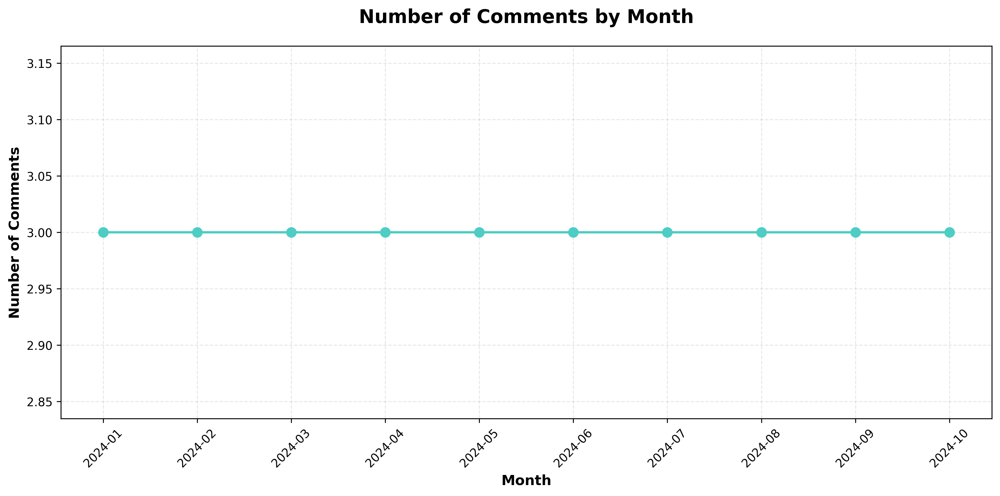
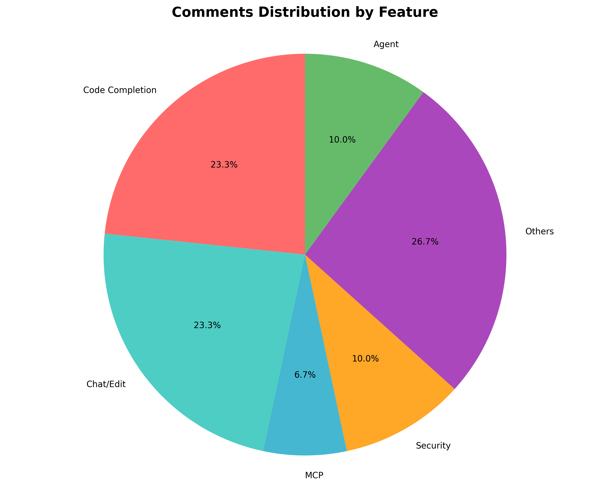
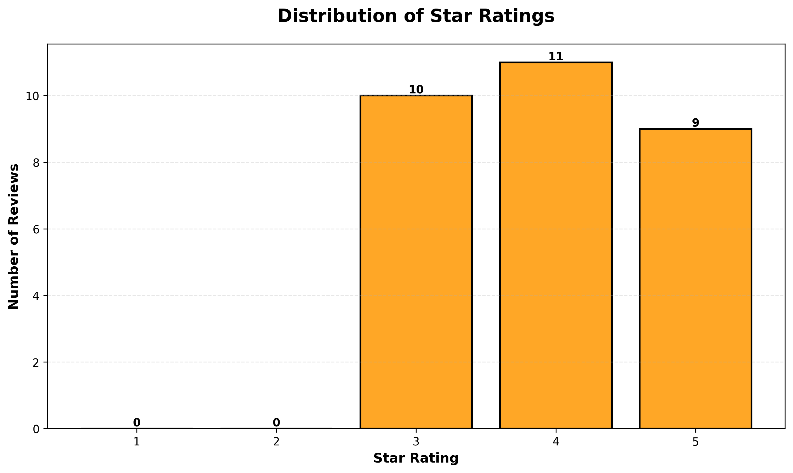

# JetBrains GitHub Copilot Plugin Reviews Summary

*Generated on: 2025-11-06 07:31:23*

## 1. Overview

- **Total Reviews Analyzed**: 30
- **Average Rating**: 3.97 / 5.0
- **Date Range**: 2024-01-01 to 2024-10-01
- **Source**: [JetBrains Plugin Page](https://plugins.jetbrains.com/plugin/17718-github-copilot/reviews)

## 2. Comments Data Visualization

### Number of Comments by Month

### Comments Distribution by Feature

**Feature Breakdown:**

- **Others**: 8 comments (26.7%)
- **Code Completion**: 7 comments (23.3%)
- **Chat/Edit**: 7 comments (23.3%)
- **Security**: 3 comments (10.0%)
- **Agent**: 3 comments (10.0%)
- **MCP**: 2 comments (6.7%)

## 3. Distribution of Stars

**Star Rating Breakdown:**

- **5 Stars**: 9 reviews (30.0%)
- **4 Stars**: 11 reviews (36.7%)
- **3 Stars**: 10 reviews (33.3%)
- **2 Stars**: 0 reviews (0.0%)
- **1 Stars**: 0 reviews (0.0%)

## 4. Bugs

### Performance

- **Number of mentions**: 6
- **Sample comments**:
  - "Code completion is amazing but sometimes slow on large files. The inline suggestions are very helpful." (Rating: 3/5)
  - "Agent mode is revolutionary! It can handle complex tasks autonomously. Performance could be better." (Rating: 5/5)
  - "Performance issues when working with large codebases. Often causes IDE to freeze." (Rating: 3/5)

### UX

- **Number of mentions**: 4
- **Sample comments**:
  - "Inline chat is useful but the UX needs improvement. Sometimes it's hard to find where to click." (Rating: 4/5)
  - "Great tool overall but crashes occasionally. UX could be more intuitive." (Rating: 3/5)
  - "Inline chat positioning is awkward. UX improvements needed for better usability." (Rating: 4/5)

### Reliability

- **Number of mentions**: 3
- **Sample comments**:
  - "Agent mode is impressive but needs better error handling. Sometimes fails silently." (Rating: 4/5)
  - "Chat history gets lost sometimes. UX bug that needs fixing." (Rating: 3/5)
  - "Overall excellent but some bugs in the latest version. Code completion still works great." (Rating: 3/5)

### Crashes

- **Number of mentions**: 2
- **Sample comments**:
  - "Performance issues when working with large codebases. Often causes IDE to freeze." (Rating: 3/5)
  - "Great tool overall but crashes occasionally. UX could be more intuitive." (Rating: 3/5)

## 5. Feature Parity

### General Negative

- **Number of requests**: 3
- **Sample requests**:
  - "Code completion works well for Python but Java support needs improvement. Feature parity with VS Code needed." (Rating: 4/5)
  - "Missing some key features from VS Code version. Feature parity is important." (Rating: 3/5)
  - "Feature parity with VS Code extension is crucial. Missing inline chat enhancements." (Rating: 3/5)

### Custom Instructions

- **Number of requests**: 2
- **Sample requests**:
  - "Love the agent capabilities! Would be great to have custom instructions support." (Rating: 5/5)
  - "Custom instructions would make this perfect. Otherwise great code completion." (Rating: 5/5)

### Model Support

- **Number of requests**: 2
- **Sample requests**:
  - "The chat is helpful but model selection is limited. Need more model options." (Rating: 4/5)
  - "Model support is limited. Would love GPT-4 or Claude integration." (Rating: 5/5)

### NES

- **Number of requests**: 2
- **Sample requests**:
  - "Inline suggestions are excellent for JavaScript. Would like to see NES integration." (Rating: 5/5)
  - "Would love NES (New Ecosystem Support) for better integration with JetBrains tools." (Rating: 5/5)

### MCP

- **Number of requests**: 1
- **Sample requests**:
  - "MCP support would be a great addition. Currently missing some features compared to VS Code." (Rating: 3/5)

